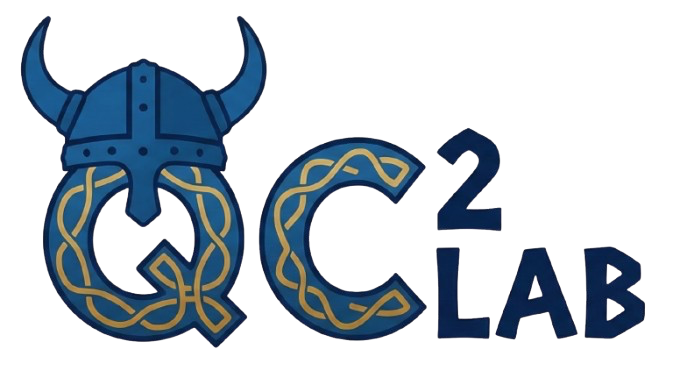

Welcome to the official webpage of the **QC2 LAB** based at Chalmers University of Technology. 

## About the Group
Supported by the Wallenberg foundations and situated within the Chalmers Microtechnology and Nanoscience department (MC2), our group focuses on developing a scalable 100-qubit superconducting quantum processor. 

## How It's Built
This website is built using a modern, responsive web stack designed for performance and accessibility:

* **Framework**: Built with **Bootstrap 5**, providing a mobile-first, responsive grid system and pre-styled UI components.
* **Styling**: Custom CSS managed through a theme-aware architecture, supporting both **Light and Dark modes** via `data-bs-theme`.
* **Icons**: Uses inline **SVG symbols** for fast, high-resolution iconography without external dependencies.

## Project Structure
- `/css`: Contains Bootstrap framework files and custom style overrides.
- `/images`: Organized by category (`carousel/`, `people/`, `papers/`, `blog/`) for easy management.
- `/js`: Contains standard Bootstrap scripts and custom theme-switching logic.
- `index.html`: The main landing page.
- `people.html`: Team member profiles and professional information.
- `publications.html`: Archived research papers and experimental studies.
- `blog.html`: The Lab's blog, containing news about publications, events, people.

## Getting Started
To view the website locally, simply open the `index.html` file in any modern web browser. No compilation or build steps are required.