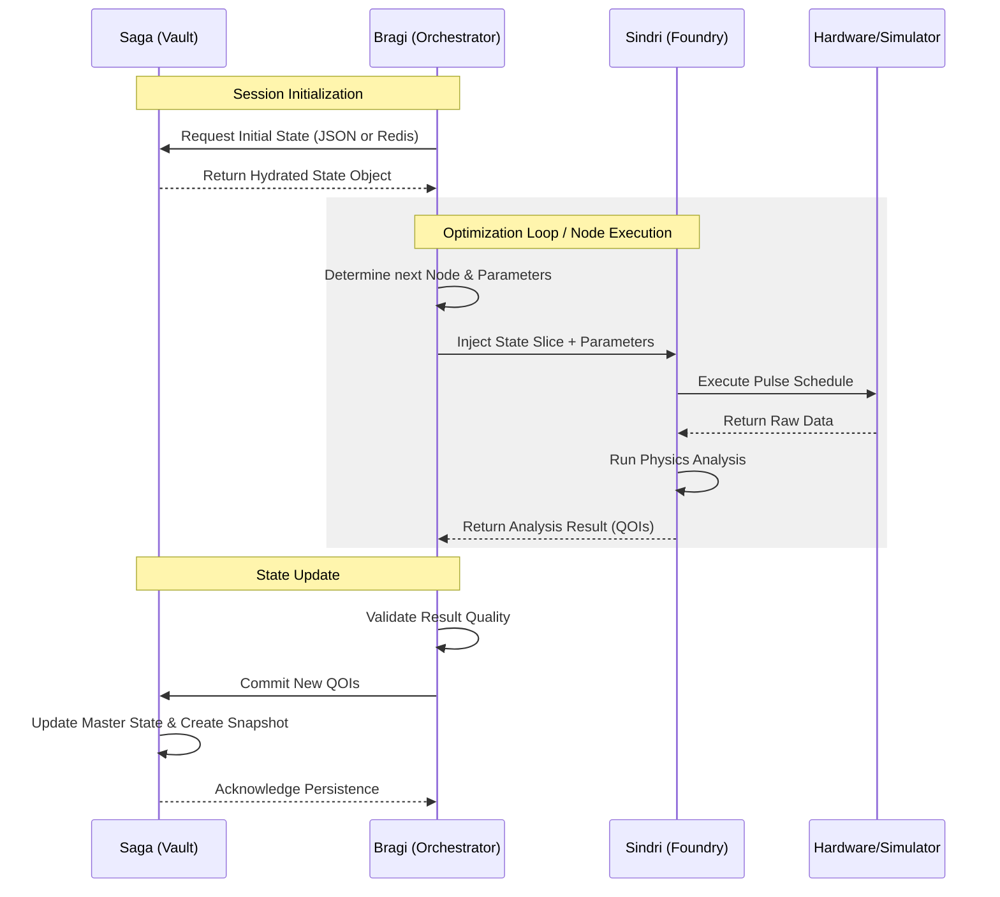

```mermaid
sequenceDiagram
    participant S as Saga (Vault)
    participant B as Bragi (Orchestrator)
    participant N as Sindri (Foundry)
    participant H as Hardware/Simulator

    Note over B,S: Session Initialization
    B->>S: Request Initial State (JSON or Redis)
    S-->>B: Return Hydrated State Object

    rect rgb(240, 240, 240)
    Note over B,N: Optimization Loop / Node Execution
    B->>B: Determine next Node & Parameters
    B->>N: Inject State Slice + Parameters
    N->>H: Execute Pulse Schedule
    H-->>N: Return Raw Data
    N->>N: Run Physics Analysis
    N-->>B: Return Analysis Result (QOIs)
    end

    Note over B,S: State Update
    B->>B: Validate Result Quality
    B->>S: Commit New QOIs
    S->>S: Update Master State & Create Snapshot
    S-->>B: Acknowledge Persistence
```